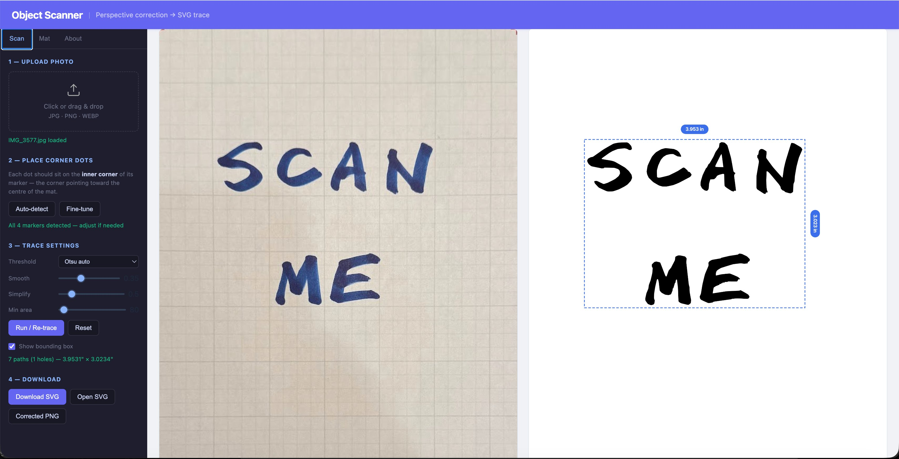
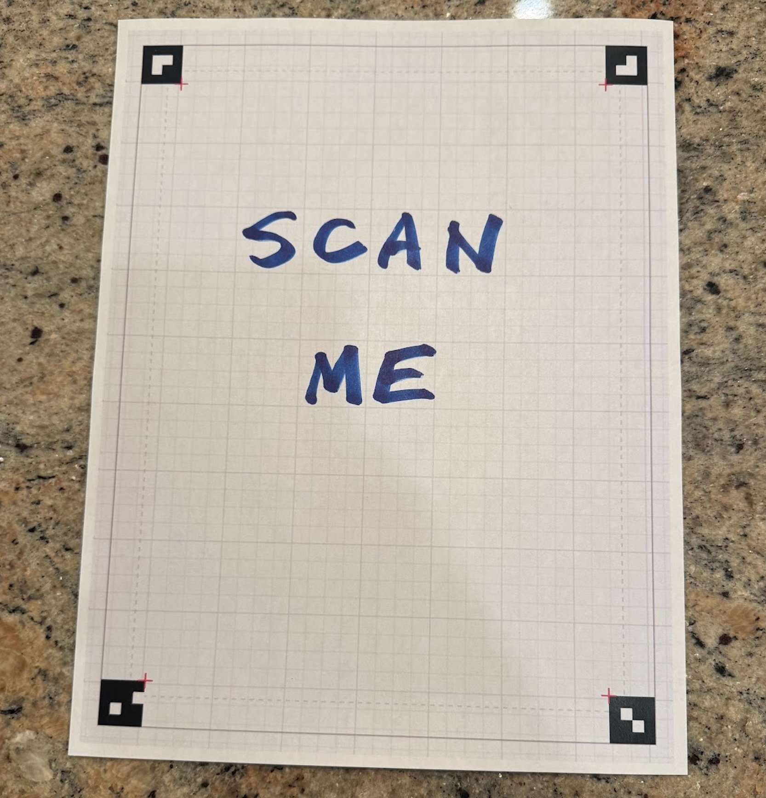

# Object Scanner — Perspective Correction → SVG Trace

A single-file browser tool. Print a grid mat, photograph an object on it from any angle, and export a dimensionally-accurate SVG trace. No server, no install, no build step.



---

## Sample

Place your object on the printed mat, photograph it, and the scanner corrects the perspective and traces the shape to a clean SVG at accurate real-world dimensions.



---

## How it works

1. **Print the mat** — US Letter sheet with four unique binary fiducial markers and a 0.25 in grid.
2. **Photograph** — place your object on the mat and shoot from any angle. All four corner markers must be visible.
3. **Correct perspective** — OpenCV computes a homography from the four inner marker corners and warps the image to a perfect top-down view.
4. **Trace** — the rectified image is thresholded and contours are traced to SVG paths using Ramer–Douglas–Peucker simplification and optional Catmull-Rom bezier smoothing.
5. **Export** — download a dimensionally-accurate SVG cropped tightly to the content bounding box.

---

## Requirements

- A modern browser (Chrome, Firefox, Safari, Edge)
- Internet on first load — OpenCV.js (~8 MB) loads from CDN and is then browser-cached
- A printed copy of the mat (see the **Mat** tab)

---

## Files

```
object-scanner/
├── scanner.html   # The entire application — open this in a browser
├── scanme.png         # Sample photo to try
├── screenshot.png     # UI screenshot
└── README.md
```

---

## Usage

### Step 1 — Print the mat

Go to the **Mat** tab.

- **Download PDF** — generates a true vector PDF with all lines, markers, and grid drawn as PDF primitives. Print at 100% scale, no fit-to-page. Exact US Letter size.
- **Print preview** — opens the PDF in a new tab for direct browser printing.

Print accurately — the physical dimensions of the mat directly determine the accuracy of the SVG output.

### Step 2 — Upload a photo

Drag and drop or click the upload zone. Accepts JPG, PNG, WEBP.

Good photo tips:
- All four corner markers fully visible and unobstructed
- Even lighting, no glare across the markers
- Object placed within the dashed inner boundary

### Step 3 — Place corner dots

Four draggable dots (TL, TR, BR, BL) appear on the preview. Each dot must be centred on the **inner corner** of its marker — the corner facing the mat centre, where the red crosshair is printed.

#### Auto-detect
Runs an OpenCV blob detector to locate the four markers automatically, then refines each corner to sub-pixel accuracy. Reports any markers it cannot find so you can adjust manually.

#### Fine-tune
Refines current dot positions using Harris corner detection on the full-resolution image. Searches only the **inner half** of each dot's circular area — geometrically constrained so it cannot snap to the wrong corner of the marker square. Click multiple times to converge.

### Step 4 — Trace settings

| Setting | Default | Description |
|---|---|---|
| **Threshold** | Otsu auto | How the image is binarised before contour detection. *Otsu auto* finds the optimal global threshold automatically. *Adaptive* adjusts per-region for uneven lighting. *Fixed* uses a manual value. |
| **Smooth** | 0.35 | Catmull-Rom → cubic bezier smoothing applied to contour corners. 0 = straight line segments; 1 = maximum smoothing. |
| **Simplify** | 0.5 | Ramer–Douglas–Peucker epsilon. Higher = fewer path nodes and smaller SVG; lower = closer to original contour. |
| **Min area** | 80 | Contours smaller than this (px²) are discarded as noise. Increase to suppress paper texture; decrease if small marks go missing. |
| **Reset** | — | Restores all settings to defaults. |
| **Show bounding box** | off | Draws a dashed rectangle with width/height dimension labels on the trace preview. Display only — not part of the SVG export. |

Click **Run / Re-trace** after adjusting. Re-runs are fast since the perspective warp is already computed.

### Step 5 — Download

| Button | Description |
|---|---|
| **Download SVG** | Exports a valid SVG at accurate physical dimensions, viewBox cropped to content. All shapes combined in one `<path fill-rule="evenodd">` so holes render correctly. |
| **Open SVG** | Opens the SVG as a blob URL in a new tab. If Inkscape (or another SVG app) is set as the OS default for SVG files, it will open there. |
| **Corrected PNG** | Exports the perspective-corrected warp as a PNG at ~384 dpi. |

---

## Dimensional accuracy

The warp canvas maps the span between the **inner corners** of the four fiducial markers. The physical size of that span is:

```
width  = 8.5 − 2 × (5/12 + 0.625) = 6.417 in
height = 11  − 2 × (5/12 + 0.625) = 8.917 in
```

The canvas is sized to this span at 384 dpi (`2464 × 3424 px`), giving square pixels and a single uniform PPI. The exported SVG `width` and `height` attributes are the physical size of the content bounding box in inches, so Inkscape, Illustrator, and other vector editors open it at the correct real-world dimensions.

---

## Pipeline

All image processing runs in-browser via **OpenCV.js 1.2.1**.

```
Photo
  → Perspective warp (Lanczos4, 384 dpi, span-correct canvas 2464×3424)
  → Grayscale
  → Grid line suppression (morphological open on inverted, light-pixel gated)
  → CLAHE (contrast-limited adaptive histogram equalisation, 8×8 tiles)
  → Gaussian blur (3×3, σ=0.8)
  → Threshold (Otsu / Adaptive / Fixed)
  → Morphological open (2×2) → close (3×3)
  → Contour detection (RETR_CCOMP + CHAIN_APPROX_TC89_KCOS)
  → Area + margin filter
  → RDP simplification
  → Catmull-Rom → cubic bezier conversion
  → Single compound SVG <path fill-rule="evenodd">
```

### Grid line suppression
The mat's light grey grid lines would otherwise appear as contours. The suppressor inverts the grayscale, applies morphological open with long horizontal and vertical kernels to detect the grid structure, gates the result against a brightness mask (only pixels originally >160 are erased), dilates by 1 px, then paints those pixels white.

### Corner placement
Each fiducial marker has a unique 4×4 binary pattern. A red crosshair is printed at the inner corner of each marker — this is the exact point the dot should be placed on.

Auto-detect uses OpenCV blob detection followed by quadrant assignment and sub-pixel refinement. Fine-tune uses a Harris corner response grid search restricted to the geometrically correct half-circle of the dot's hit area, followed by iterative gradient descent to sub-pixel accuracy.

---

## Dependencies

Loaded from CDN on first use, then browser-cached:

| Library | Version | Purpose |
|---|---|---|
| OpenCV.js | 1.2.1 | Full image processing pipeline |
| jsPDF | 2.5.1 | Vector PDF mat generation |

---

## Limitations

- All four corner markers must be at least partially visible. Heavily clipped markers may not be found by Auto-detect.
- Strong glare on the paper surface or very dark ambient conditions reduce threshold accuracy.
- The mat must be printed at exactly 100% scale on US Letter paper for physical dimensions to be accurate.
- OpenCV.js takes 5–15 s to initialise on first load depending on connection speed.
- Running as a local `file://` URL shows a harmless security origin warning in the browser console.
